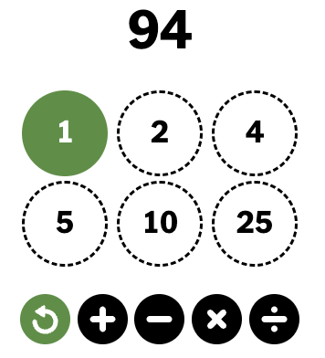

# nyt-digits-solver

A tiny project about generating solutions to the NYT's *Digits* daily math puzzle with Prolog.

## Digits

In *Digits*, players are given a set of six numbers of which they have to apply arithmetic operations ($+$, $-$, $\div$, $\times$) to in order to produce a target number (or yield a total as close to the number as possible; in the game, final score is a function of your distance). Numbers used to create new numbers cannot be used again; instead the new number can now be manipulated upon by any other (new) numbers.

E.g., the following puzzle:



has the trivial solution $(4\times 25)-(1+5)=100-6=94$.

## Usage

The prolog predicate `solve_digits/2` takes in a list of operable digits (1, 2, 4, 5, 10, and 25 in the above example) and a target number (94 in the example). The predicate holds if it can find a combination of expressions that yield the target number, satisfying the game rules.

```prolog
?- solve_digits([1, 2, 4, 5, 10, 25], 94).
10+(4+5)+25*(1+2)         = 94
true .
```

and with a higher-level problem:

```prolog
?- solve_digits([3, 13, 19, 20, 23, 25], 456).
19*25-(23-(20-(3+13)))    = 456
true .
```

Pressing `;` will generate further solutions, `.` will terminate the search.

Solutions found with this predicate are often repeated, as the lazy approach does not procedurally filter out duplicates induced by ordering, e.g. $(4\times 25)-(1+5)$ is considered distinct from $(25\times 4)-(1+5)$.

---

The predicate `solve_digits_unique/2` finds all solutions to a puzzle, and filters them according to Prolog's arithmetic expression grammar to remove some duplicates. Currently this takes quite a while (15 seconds on the below query) since it is an exhaustive search. Duplicate solutions produced by ordering (such as the above example) are filtered out, but subtle "repetitions" are still possible, for example:

```prolog
?- solve_digits_unique([3, 5, 11, 13, 19, 20], 428).
...
19*(11+13)-20-5-3         = 428
true ;
19*(11+13)-20-3-5         = 428
true ;
19*(11+13)-5-20-3         = 428
true ;
19*(11+13)-5-3-20         = 428
true ;
19*(11+13)-3-20-5         = 428
true ;
19*(11+13)-3-5-2          = 428
true .
```

is outputted despite `20-5-3 = 20-3-5 = ...`, since Prolog's arithmetic operators are left-associative, so `19*(11+13)-20-5` and `19*(11+13)-20-3` are technically different expressions operated on by `- 3` and `- 5` in the above example, respectively.

Note that this is more of a proof-of-concept as it stands; I plan on eventually addressing the computational overhead of finding all solutions either through `CLP(FD)` or a smarter grammar.
